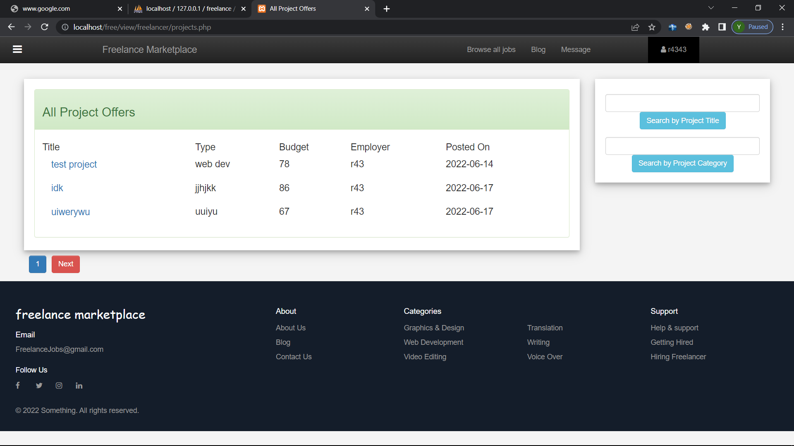

# Ethio-Freelance-Marketplace

This is a project

## Table of contents

- [Overview](#overview)
  - [Screenshot](#screenshot)
  - [Links](#links)
  - [Built with](#built-with)
  - [Author](#author)

## Overview

A freelance Marketplace platform is an online platform where businesses can find and hire individual contractors to do some work remotely. The platform acts as an intermediary providing a safe and convenient way to contract remote experts for one-time projects.
The proposed system is a centralized Freelance Marketplace which connects employers with freelancers who can perform some work remotely or in person if necessary. This project aims to develop a freelance marketplace where not only an employer could post a project for bidding but a freelancer could also offer his/her services for buyers.

### Screenshot

### Links

- Solution URL: (https://github.com/Yab1/news-homepage)
- Documentation: (https://docs.google.com/document/d/1MCV5CR7VZUrKlUu4WpAYW28AX8t6cklNuxXPW0wOboM/edit?usp=sharing)

### Built with

- Semantic HTML5 markup
- CSS custom properties
- JS basic
- PHP

## Author

- [@Yab1](https://github.com/Yab1)
- [@Robel43](https://github.com/Robel43)
- [@]()
